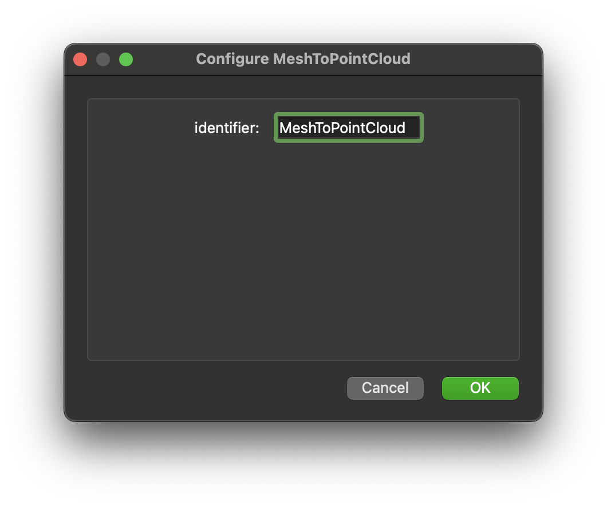

.. _mcp-mesh-to-point-cloud-configuration:

Configuration
=============

This dialog allows you to configure the step identifier.

Available Options
-----------------

1. **Step Identifier**

   You can set the step identifier directly in this configuration dialog.

.. _fig-mesh-to-point-cloud-configuration:

   **Mesh to Point Cloud** configuration interface.
