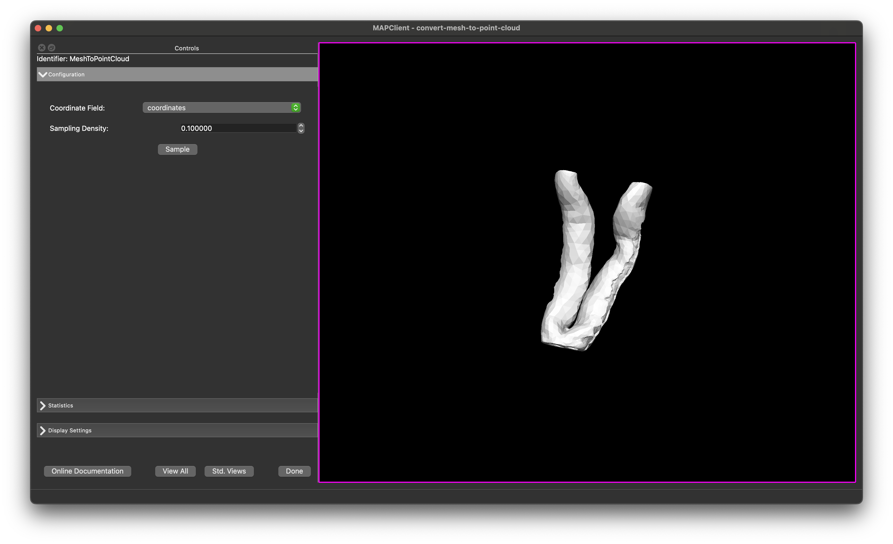
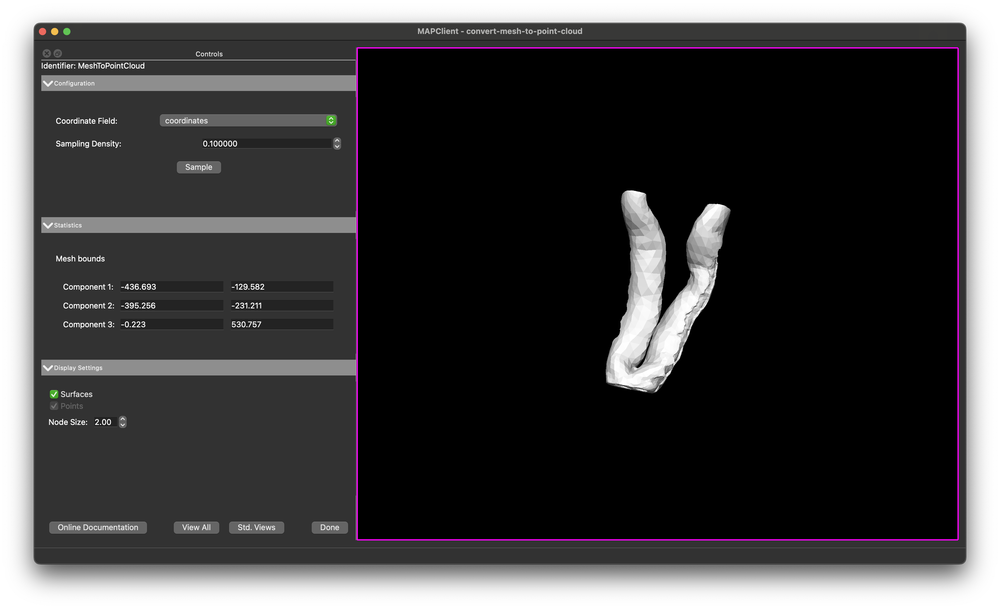
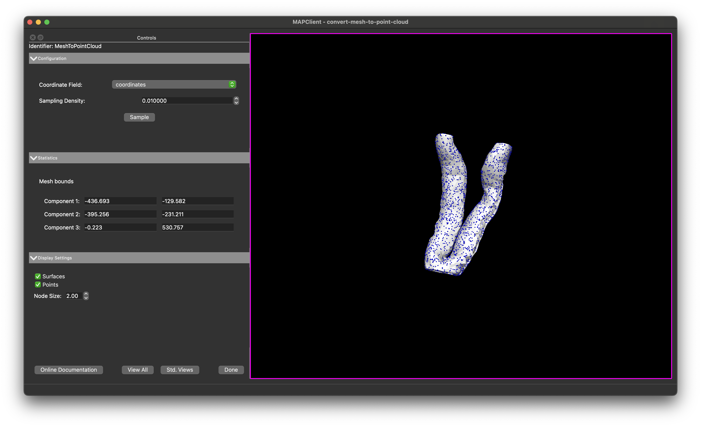

Mesh to Point Cloud Step
========================

Overview
--------

The **Mesh to Point Cloud** step is an interactive plugin for the MAP-Client.

This plugin takes a `Zinc` compatible mesh EXF file as an input, and provides an interactive GUI allowing the user to create a point cloud by sampling the surface of the mesh.
The **Mesh to Point Cloud** step outputs a new `Zinc` EXF file defining the sampled data points.

Specification
-------------

Information on this plugin's specifications is available :ref:`here <mcp-mesh-to-point-cloud-specification>`.

Configuration
-------------

Information on this plugin's configuration is available :ref:`here <mcp-mesh-to-point-cloud-configuration>`.

Workflow Setup
--------------

Information on setting up a workflow with this plugin can be found :ref:`here <mcp-mesh-to-point-cloud-workflow-setup>`.

Instructions
------------

When the plugin loads for the first time you should see something like the image displayed in :numref:`fig-mesh-to-point-cloud-initial`.
That is, you should see lines of your mesh displayed with yellow lines and white spheres depicting the nodes in the mesh.

.. _fig-mesh-to-point-cloud-initial:

   **Mesh to Point Cloud** user interface in its initial state.

Graphics Coordinates
^^^^^^^^^^^^^^^^^^^^

The coordinate fields used for the mesh is determined automatically, but can be changed using the combo-boxes in the `Configuration` section if required.

Display Settings
^^^^^^^^^^^^^^^^

There are a number of check-boxes in the `Display Settings` section of the user interface (UI).
Initially, only the `Surface` is enabled (as long as a mesh was successfully loaded from the EXF input) - as this is the only graphics that have been created at this point.

The size of the data-points can be adjusted with the `Node Size` spin box.
If the points appear too small or if they aren't initially visible, try increasing this value.

View
^^^^

The `View All` button will reset the view of the mesh so that the whole mesh is visible within the scene.
The `Std. View` button will reset the view to the next nearest standard view, continually clicking the `Std. View`button will cycle through the standard views.

General
^^^^^^^

The `Done` button will finish the step and continue with the workflow execution.

Usage
-----

The **Mesh to Point Cloud** step allows the user to sample the surface of a mesh and create a point cloud.
In the `Configuration` section, the user can set the density of points to generate over the surface of the mesh.
The `Point Density` spin box allows the user to specify how many points to generate per unit square of surface area.
The `Statistics` section displays the extent of the mesh, so you can use this to estimate a starting point for the point density setting.

.. _fig-mesh-to-point-cloud-all-panels:

   **Mesh to Point Cloud** showing the configuration panel, statistics panel, and display settings panel.

Clicking the `Sample` button will sample the surface of the mesh and create a point cloud.
The points will be displayed in the scene as blue spheres.

.. _fig-mesh-to-point-cloud-sampled:

   **Mesh to Point Cloud** showing the result of clicking the `Sample` button.

The `Sample` button will only sample the surface of the mesh once, so if you want to change the point density or other settings, you will need to click the `Sample` button again after making changes.

Finishing
---------

Clicking the `Done` button will output the data points to a `Zinc` EXF file and will execute any additional workflow steps connected to the **Mesh to Point Cloud** step.
