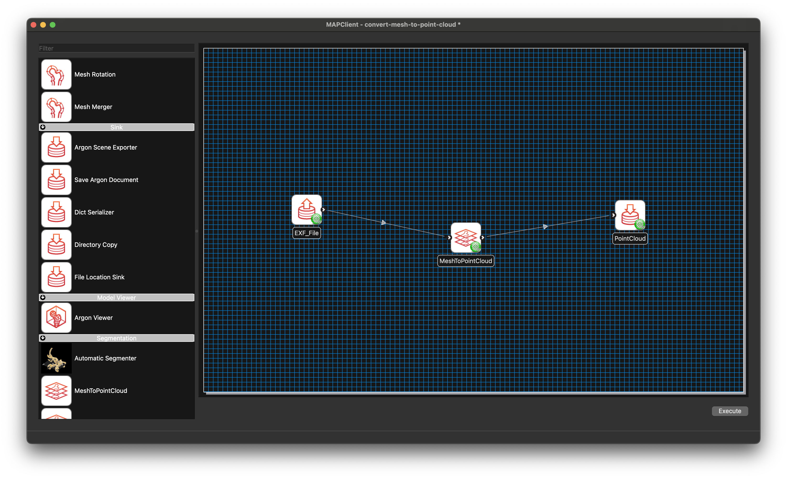

.. _mcp-mesh-to-point-cloud-workflow-setup:

Workflow Setup
--------------

To set up a **Mesh to Point Cloud** workflow:

1. Add a **File Chooser** step (or another step that provides a `Zinc` mesh EXF file) and a **Mesh to Point Cloud** step to the workflow area.
2. Configure the **File Chooser** step to specify the `Zinc` EXF file that defines the mesh to be sampled.
3. Connect the output port of the **File Chooser** step to the input port of the **Mesh to Point Cloud** step, as shown in :ref:`Fig. 1 <fig-mesh-to-point-cloud-workflow>`.
4. The **Mesh to Point Cloud** step does not require additional configuration—it is ready to use by default.
5. Connect the output port of the **Mesh to Point Cloud** step to another step depending on your objective. In :ref:`Fig. 1 <fig-mesh-to-point-cloud-workflow>`, the output is connected to a **File Location Sink** step, which allows you to specify a local directory for saving the output file.

.. _fig-mesh-to-point-cloud-workflow:

   **Mesh to Point Cloud** workflow connections.

Once the workflow is set up, save it and click the `Execute` button to launch the **Mesh to Point Cloud** GUI.
